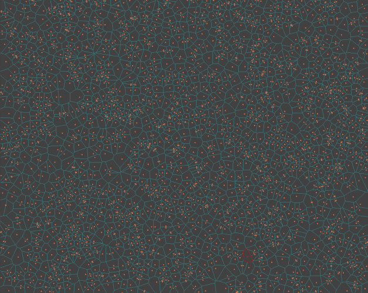
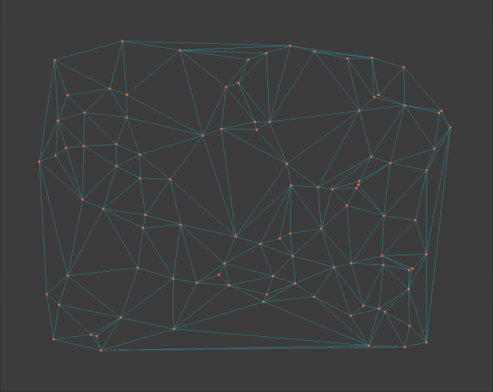

# Description
Currently, *dvoronoi* implements Fortune's algorithm for generating Voronoi diagrams. It is, more or less, a fork of Pierre Vigier's excellent C++ implementation (https://github.com/pvigier/MyGAL).

It is a header-only, C++20 implementation, built and tested on:
- Windows 10, VS 2017, compiler version 19.36.32532
- WSL Ubuntu 23.04, GCC 13.0.1

## Motivation
I wanted to try using Voronoi diagrams in a different project and decided to try my hand at my own implementation, as I thought it's a good opportunity to learn more about algorithms and data structures, new C++ standards, performance profiling and so on.
Performance of my own implementation was worse than Pierre's, so I decided to fork his and see if there are any optimization opportunities left from there.

# Features
- generates Voronoi diagram using Fortune's sweep line algorithm
- good numerical stability by using double precision internally
- optional user data for half edge and face structures
- intersection with a box
- Delaunay's triangulation can be obtained from the Voronoi diagram
- convex hull of sites (using Andrew's monotone chain)
- Lloyd relaxation

# Structure
|                 |                                                                                                          |
|-----------------|----------------------------------------------------------------------------------------------------------|
| `benchmark`     | benchmark and comparison with other implementations                                                      |
| `common`        | common stuff, some internal, some not, unrelated to a specific algorithm                                 |
| `random`        | simple example and test bench, using randomly generated points                                           |
| `fortune`       | contains the user api `algorithm.hpp` entry point, as well as Fortune's algorithm implementation details |
| `visualization` | SFML based visualization                                                                                 |
 
# Performance
On my AMD Ryzen 9 5900X 4.2GHz with 64GB of RAM, Windows 10 with MSVC, it computes the Voronoi diagram for 100K random points (including bounding) in about 220ms, which is (not surprisingly) similar to *MyGAL*'s performance.
After playing around with pmr and custom allocators, I found a few optimization opportunities, that brought the performance gain over *MyGAL* to about 10% on linux and 21% on Windows. Using custom allocators did not seem to bring much on linux, and a relatively small improvement on Windows (about 4%), so I decided to leave them disabled.

I've also compared to Mathias Westerdahl's *jcv* implementation in C (https://github.com/JCash/voronoi). Unfortunately, it was not stable for 100K points, unless switched to using double precision. In that case, *dvoronoi* is about 29% faster on Windows.  
